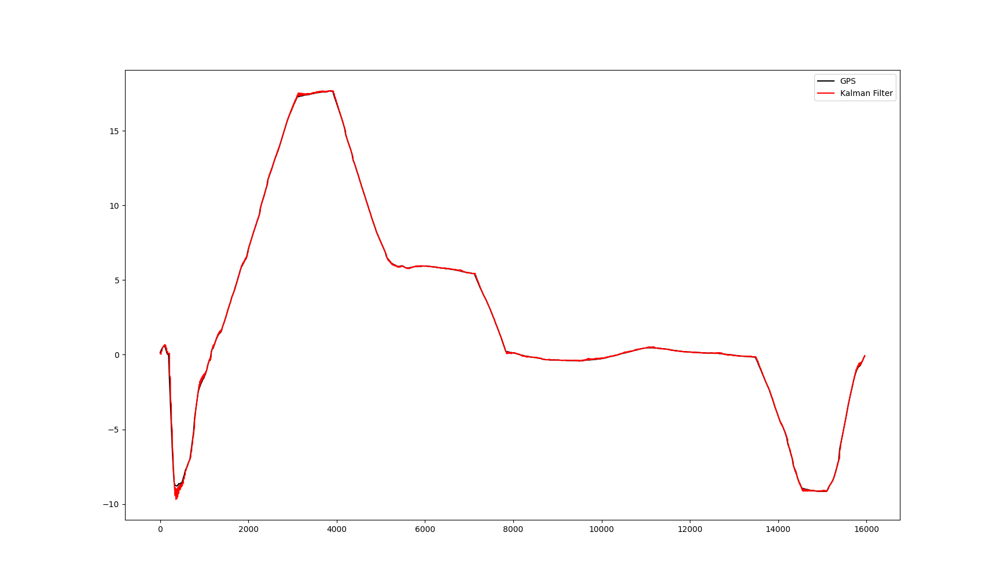
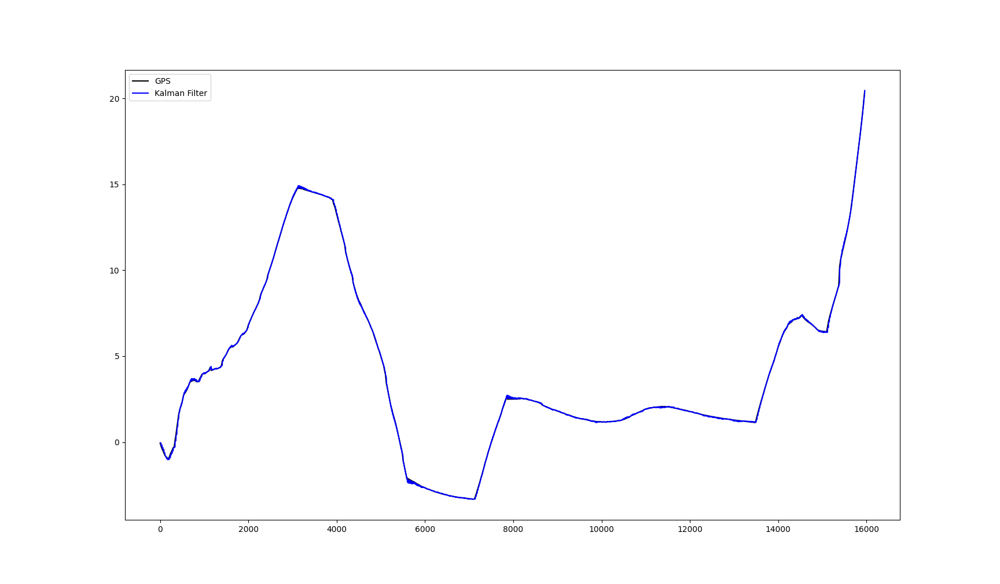

# EKF for IMU and GPS FUSION





  

$$
\begin{aligned}
&x = f(x, u) + w \\
&w\in N(0,Q)
\end{aligned}
$$


$$
\begin{aligned}
&z = h(x) + v \\
&v\in N(0,R)
\end{aligned}
$$


$$
\begin{align}
&x_{k/k-1}=Ax_{k-1/k-1}+Bu_k\tag{1}\\
&P_{k/k-1}=AP_{k-1/k-1}A^T+Q\tag{2}\\
\end{align}
$$


$$
\begin{align}
&K_k=\frac{P_{k/k-1}H^T}{HP_{k-1/k-1}H^T+R} \tag{3}\\
&x_{k/k}=x_{k/k-1}+K_k(z_k-Hx_{k/k-1}) \tag{4}\\
&P_{k/k}=(I-K_kH)P_{k/k-1} \tag{5}
\end{align}
$$

   
[具体imu与gps文档](https://pan.baidu.com/s/1bigJYQUTd0TCfswACV3pUg?pwd=8919)
```bash
gps:
roslaunch roslaunch nmea_navsat_driver nmea_serial_driver.launch
imu:
roslaunch ekf rviz_and_imu.launch
```


```bash
roslaunch ekf gps_to_xyz.launch
```


```bash
python3 ekf.py
```